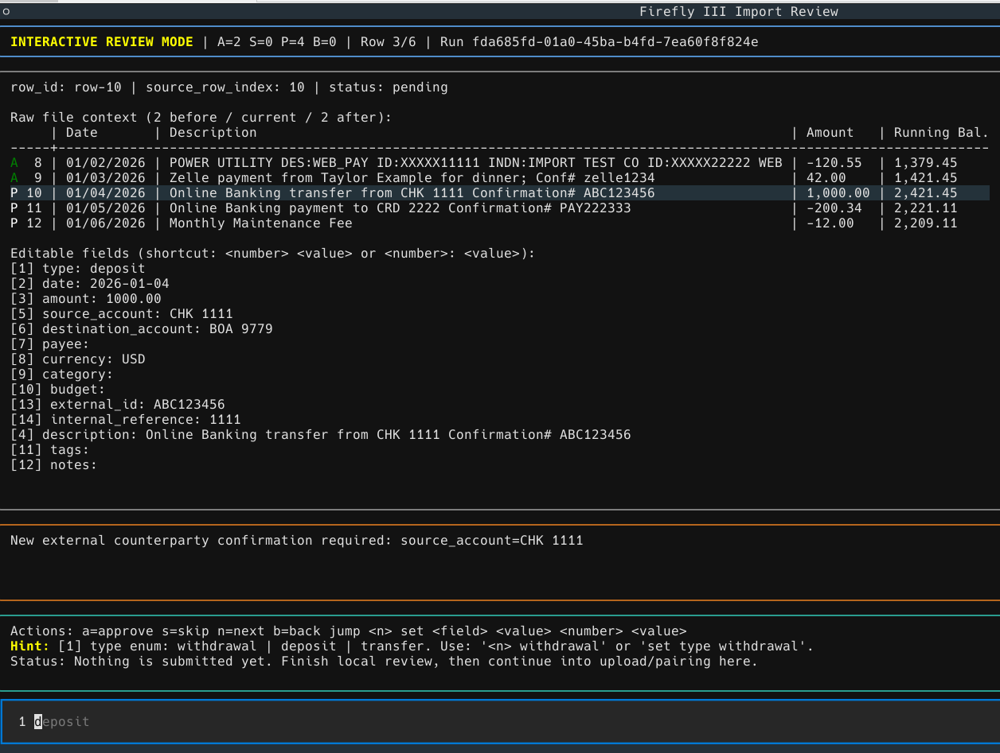
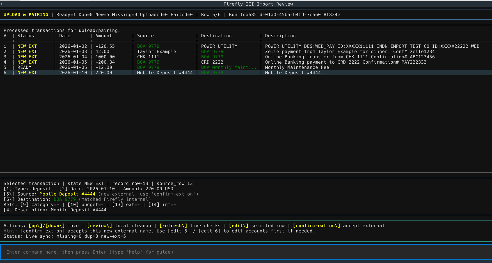

# Firefly III Import Tool

Minimal interactive importer for messy bank `CSV`/`XLSX` files.

## Setup

```bash
python -m venv .venv
source .venv/bin/activate
pip install -r requirements.txt
```

## Firefly API credentials

Either export env vars:

```bash
export FIREFLY_URL="https://your-firefly-host"
export FIREFLY_TOKEN="<personal-access-token>"
```

Or create a project-root `FIREFLY.yaml` from the tracked example:

```bash
cp FIREFLY.example.yaml FIREFLY.yaml
```

Supported YAML keys:

```yaml
firefly_url: https://your-firefly-host
firefly_personal_access_token: <personal-access-token>
```

`FIREFLY.yaml` is git-ignored. `FIREFLY.example.yaml` is tracked.

## Commands

```bash
python -m ff3_importer import path/to/statement.csv [--profile bank_profile] [--dry-run]
python -m ff3_importer resume <run_id> [--dry-run]
python -m ff3_importer rollback <run_id>
python -m ff3_importer profiles list
python -m ff3_importer profiles show <profile_name>
```

## Runtime data

Generated runtime data is stored in:

- `runtime_data/profiles/`
- `runtime_data/sessions/`
- `runtime_data/runs/`
- `runtime_data/history/`

`runtime_data/` is ignored by git.

## Notes

- `--profile` is optional for CSV imports. If omitted, the tool tries to auto-detect a matching profile from header signatures.
- Review is done in a Textual TUI and requires an interactive terminal (TTY).

## Screenshots

The screenshots below use a mock test dataset. They do not contain live personal banking data.

### Interactive review



### Upload and pairing


